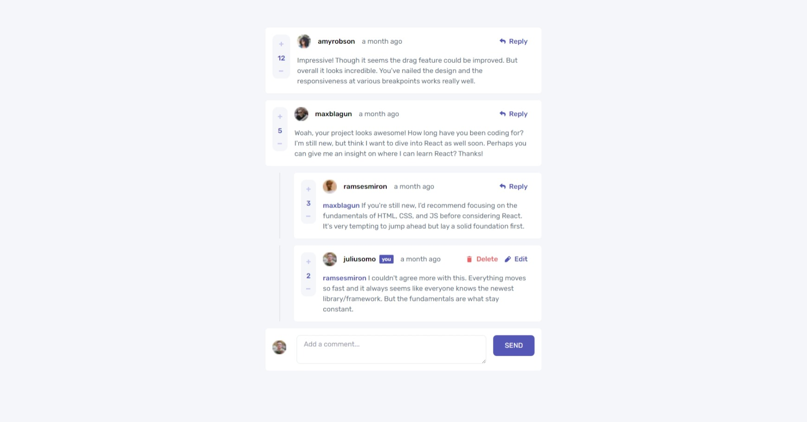
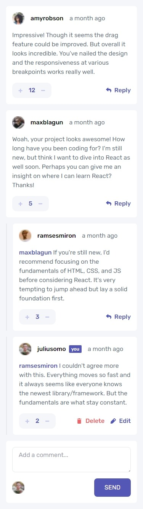

  

# Frontend Mentor - Interactive comments section solution

  

  

This is a solution to the [Interactive comments section challenge on Frontend Mentor](https://www.frontendmentor.io/challenges/interactive-comments-section-iG1RugEG9). Frontend Mentor challenges help you improve your coding skills by building realistic projects.

  

  

## Table of contents

  

  

- [Overview](#overview)

  

- [The challenge](#the-challenge)

  

- [Screenshot](#screenshot)

  

- [Links](#links)

  

- [My process](#my-process)

  

- [Built with](#built-with)

  

- [What I learned](#what-i-learned)

  

- [Continued development](#continued-development)

  

- [Useful resources](#useful-resources)

  

- [Author](#author)

  

- [Acknowledgments](#acknowledgments)

  

  
  

  

## Overview

  

  

### The challenge

  

  

Users should be able to:

  

  

- View the optimal layout for the app depending on their device's screen size

  

- See hover states for all interactive elements on the page

  

- Create, Read, Update, and Delete comments and replies

  

- Upvote and downvote comments

  

-  **Bonus**: If you're building a purely front-end project, use `localStorage` to save the current state in the browser that persists when the browser is refreshed.

  

-  **Bonus**: Instead of using the `createdAt` strings from the `data.json` file, try using timestamps and dynamically track the time since the comment or reply was posted.

  

  

### Screenshot

  

  





  
  
  

  

### Links

  

  

- Solution URL: [Solution](https://www.frontendmentor.io/solutions/interactive-comment-section-using-next-and-typescript-I6OG7ES73y)

  

- Live Site URL: [Vercel](https://interactive-comment-section-next-typescript.vercel.app/)

  

  

## My process

  

  

### Built with

  

  

- Semantic HTML5 markup

  

- CSS custom properties

  

- Flexbox

  

- CSS Grid

  

- Mobile-first workflow

  

- [React](https://reactjs.org/) - JS library

  

- [Next.js](https://nextjs.org/) - React framework

  

- [Tailwind CSS](https://tailwindcss.com/) - For styles

  

  


  

  

### What I learned

  

  
- How to declare state in React and its Type, also how to declare an empty value of the Type
```jsx
const [currentUser, setCurrentUser] = useState<User>({} as User);
```

  
- How to sort state array:
We cant just directly sort state array, because its immutable so we cant change the value directly, but what we can do is declare the new/changed state in a variable and then assign that variable to the state
```jsx
const sortComments = () => {
	const sortedComments = [...comments]
	sortedComments.sort(function(a: Comment, b: Comment){return b.score - a.score})
	setComments(sortedComments)
}
```

- How to add an object as a child to an array of object state:
This also applies when we want to make changes to the array state
```jsx
const handleReplyComment = (newReply: Reply, commentId: number) => {
	const addReply = comments.map((comment) => {
	if(comment.id === commentId) {
		return {
			...comment,
			replies: [
				...comment.replies,
				newReply
			]}
		} else {
			return comment
		}
	})
	setComments(addReply);
};
```
  - How to declare variable type, also nested type:
  
```jsx
  interface Comment {
	id: number,
	content: string,
	score: number,
	user: User
	createdAt : string
	replies: ReplyProps[]
}

interface ReplyProps {
	id: number,
	content: string,
	score: number,
	user: User
	createdAt : string
	replyingTo: string
}
```
- How to make a props variable conditional, also if you do that, you need to check again if the variable is there so that it does not throw an error:
```jsx
type UserDetailProps = {
	onDeleteComment?: (commentId: number) => void
}

const handleDeleteClick = () => {
	onDeleteComment ? (onDeleteComment(commentIdToDelete)) : null
}
```

  

  

### Continued development

  
- Add this as a full stack project
- Save in state whether the current user has upvoted or downvoted the comment/reply, so it can only be done once
- Keep track of the edited posts, such as labeling that the post is edited, when the last change is made an such
  


  

  

  

  

### Useful resources

  - [Updating Arrays in State – React](https://react.dev/learn/updating-arrays-in-state) - This helped me so much in updating array in state, such as how to add, update and delete. Also how to update nested array of object in state

- [Rendering: Client Components | Next.js (nextjs.org)](https://nextjs.org/docs/app/building-your-application/rendering/client-components) - This helped me understand what is the difference between client and server components, how to implement them and what is the best practices
  

  

  

  

## Author

  


- Website - [Taufiq Mahdi Portfolio](https://taufiqmahdi-personal-portfolio.vercel.app/)


- Frontend Mentor - [@taufiqmahdi](https://www.frontendmentor.io/profile/taufiqmahdi)
- Twitter - [@taufiqmhdi](https://www.twitter.com/taufiqmhdi)
  

  


  
